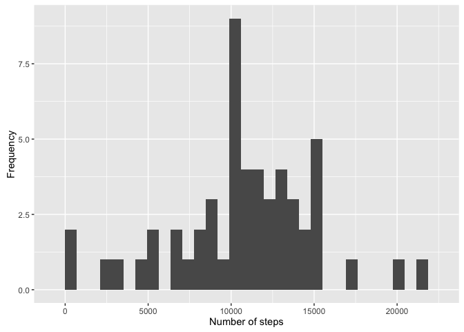
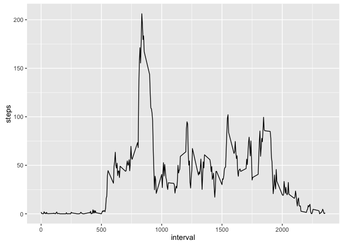
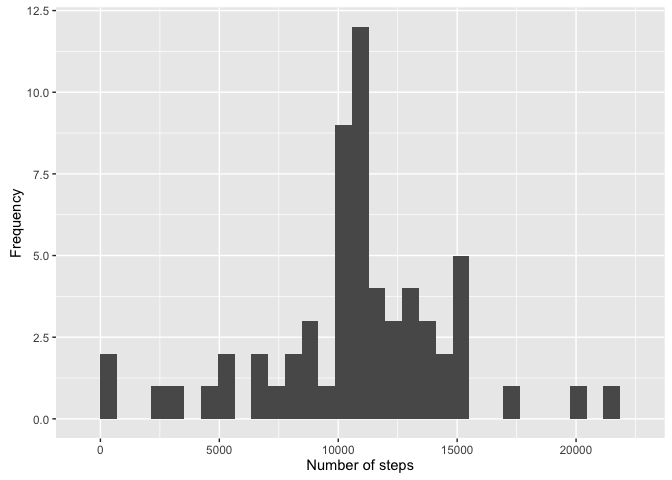
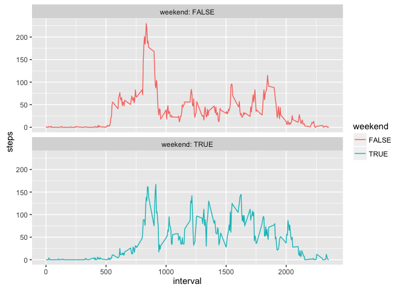

# Reproducible Research Assignment 1
Darragh McLernon  
17 January 2016  

#Loading and preprocessing the data
The data is loaded from the working directory and read as a CSV file.

```r
#Setting the working directory
setwd("~/Documents/coursera/reproducible_research/")

library(dplyr)
```

```
## 
## Attaching package: 'dplyr'
```

```
## The following objects are masked from 'package:stats':
## 
##     filter, lag
```

```
## The following objects are masked from 'package:base':
## 
##     intersect, setdiff, setequal, union
```

```r
library(ggplot2)

#Loading and preprocessing the data
unzip("./activity.zip")
activity_data <- read.csv("./activity.csv")
```

#What is mean total number of steps taken per day?

##Make a histogram of the total number of steps taken each day

Firstly, I generated the total number of steps each day using the aggregate() function

```r
daily_steps_data <- aggregate(steps ~ date,data=activity_data,sum)
```

I plotted the histogram using the daily_steps_data just calculated

```r
qplot(daily_steps_data$steps, xlab = "Number of steps", ylab = "Frequency")
```

```
## `stat_bin()` using `bins = 30`. Pick better value with `binwidth`.
```

\

##Calculate and report the mean and median of the total number of steps taken per day
Using the summary function I quickly found the mean and median number of steps taken. I also got other useful statistics about the data such as Min and Max and quartile values.

```r
summary(daily_steps_data$steps)
```

```
##    Min. 1st Qu.  Median    Mean 3rd Qu.    Max. 
##      41    8841   10760   10770   13290   21190
```

#What is the average daily activity pattern?

##Make a time series plot of the 5-minute interval (x-axis) and the average number of steps taken, averaged across all days (y-axis)
To generate a plot of steps averaged over the daily intervals I first aggregated the data.

```r
#Calculate the interval means
interval_mean <- aggregate(steps ~ interval, data=activity_data, mean)
```

With the aggregated data I plotted the graph using the ggplot function

```r
#Plot the graph
ggplot(data=interval_mean,aes(x=interval, y=steps, group=1)) +
    geom_line()
```

\

##Which 5-minute interval, on average across all the days in the dataset, contains the maximum number of steps?
To find the max I called the which.max function across the steps column

```r
interval_mean[which.max(interval_mean$steps),]
```

```
##     interval    steps
## 104      835 206.1698
```

#Imputing missing values
##Calculate and report the total number of missing values in the dataset (i.e. the total number of rows with 𝙽𝙰s)
Here I used the sum function on NA values to find the total number of missing values

```r
sum(is.na(activity_data$steps))
```

```
## [1] 2304
```

##Devise a strategy for filling in all of the missing values in the dataset. The strategy does not need to be sophisticated. 

To fill in the missing data I've decided to replace the missing values with the mean for each 5 minute interval.

I cloned the data frame so the original is left unchanged. I then followed these steps;
- Cloned the original data and stored as the variable "fixed_activity_data"
- From the cloned data I located the position of all of the missing values and stored as list of boolean values
- Got the list of mean values for all of the observations
- Rounded the mean values to whole numbers
- Replaced the missing values with the means where the boolean list was TRUE

```r
#Re-create the original data
fixed_activity_data <- activity_data

#Get a list of where the NA values are 
na_values <- is.na(fixed_activity_data$steps)

#Get the list of average values
mean_values<- tapply(fixed_activity_data$steps, fixed_activity_data$interval, mean, na.rm=TRUE, simplify=TRUE)

#Round the mean values to whole numbers
mean_values <- round(mean_values, 0)

#Replace the NA values with the list of means
fixed_activity_data$steps[na_values] <- mean_values[as.character(fixed_activity_data$interval[na_values])]
```

I decided to round the steps to full numbers to keep consistent with the rest of the data and having a fraction of a step doesn't really make sense. There will be a tiny loss of precision but I think this effect would be negligible given that it'll only ever be 1 step either way of the actual value at most


##Make a histogram of the total number of steps taken each day and Calculate and report the mean and median total number of steps taken per day.


```r
#Calculate the total steps per day
fixed_daily_steps_data <- aggregate(steps ~ date,data=fixed_activity_data,sum)
```


```r
#Plot the graph
qplot(fixed_daily_steps_data$steps, xlab = "Number of steps", ylab = "Frequency")
```

```
## `stat_bin()` using `bins = 30`. Pick better value with `binwidth`.
```

\


```r
#Calculating the median and mean
summary(fixed_daily_steps_data$steps)
```

```
##    Min. 1st Qu.  Median    Mean 3rd Qu.    Max. 
##      41    9819   10760   10770   12810   21190
```

The new median and mean values do not appear to have changed from the data set where the NA values were present. Although the first and third quartiles have. I would consider this an indication that the method used to fill in NA values hasn't inappropriately skewed the data. If I hadn't rounded the steps the results would no doubt have been different. Further analysis would be required to determine if rounding the data produced more accurate results or not.

#Are there differences in activity patterns between weekdays and weekends?

##Create a new factor variable in the dataset with two levels
Here I decided to create a new column to the data with a type of boolean. TRUE would indicate a weekend and FALSE indicates a weekday. To achieve this I used the following approach;
- I got a list of the days from the data frame in plain text using the weekdays() function
- I checked the list against the values "Saturday" and "Sunday" which produced the boolean list
- The boolean list was then appended to the data frame with the column heading "weekend"

```r
#Get the list of days
list_of_days <-  weekdays(as.Date(fixed_activity_data$date, format = "%Y-%m-%d"))

#Check if it's a weekend day and add the result to the data set as a list of boolean values (Weekday is FALSE and weekday is TRUE)
fixed_activity_data[,"weekend"] <- list_of_days == "Saturday" | list_of_days =="Sunday"
```

To produce the graph I had to group the data by 'interval' and 'weekend'. After grouping, I summarised the values by a mean value for steps taken for each group.

```r
#Add the groupings for the interval and the weekend and save to new data set
weekday_mean_data <- group_by(fixed_activity_data, interval, weekend)

#get the mean number of steps for interval and week day type - Mean is rounded to whole numbers
weekday_mean_data <- summarise(weekday_mean_data, steps = round(mean(steps)))
```

The plot was created using ggplot

```r
ggplot(weekday_mean_data, aes(x=interval, y=steps, color = weekend)) +
    geom_line() +
    facet_wrap(~weekend, ncol = 1, nrow=2, labeller = "label_both")
```

\

The two plots show distinct patterns. The weekend:FALSE (weekdays) plot shows very little activity until around 6am where there is then a spike in the number of steps taken to around 40-60 per 5-minute intervals. This continues until around 07:30-8:00am where there is another sharp spike to over 200 steps per 5-minute interval. This spike drops dramatically over the next hour. For the rest of the day the number of steps remains below 120. However we do see three more distinct spikes in number of steps at around 1pm, 3:30-4pm and 6pm.

The weekend:TRUE (weekends) data starts similarly to the weekdays plot where there is little activity until around 6am although the rise is more gradual and peaks at a lower maximum of around 160 steps per 5-minute interval. Throughout the rest of the day there are consistent sharp rises and falls in the number of steps taken with a drop off at around 9pm.

Given the above information I would suggest the data is taken from someone who works a 9-5 type job during the week with a less structured weekend. Each spike in the plot is consistent with a particular part of this type of job
- 6am; Getting up and getting ready for work
- 07:30 to 8am; Travelling to work
- 1pm; Leaving work to get lunch
- 3:30-4pm; perhaps work-related activity
- 6pm; leaving work and travelling home

The less consistent and pronounced spikes in the weekend data would suggest the person has a less structured weekend where they may be more active or less active at different times each weekend. 
